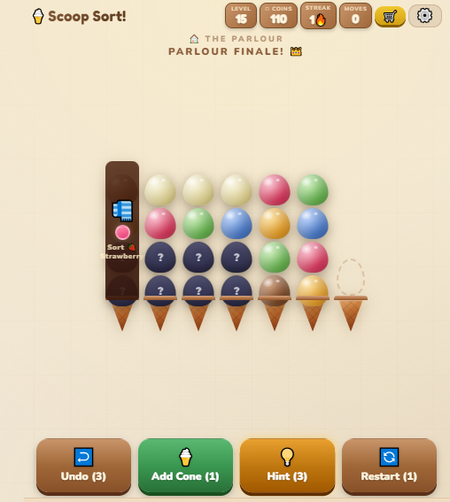

## What can a computer do for me? {.welcome}

[GEAP 103 · Day 1]{.smallcaps}

::: {.large .space}
What would you like to make?

What would you like to learn?
:::

::: {.space}
Today: a place for your files, and a list of your wishes.
:::

::: {.notes}
0:00–0:10. Welcome and device check. Introduce yourself briefly. Say that the course gives students practice explaining what they want in English and using computers to make things that matter to them. Their interests can change.

Ask students to open a folder on their own device or OneDrive. Note who needs a loan/campus-computer route. A phone can support discussion and writing today, but arrange access to a computer for the file tasks. Partner demonstration is practice, not evidence that the other student can do the task independently.

Tell students they can use the supplied practice files and invented examples. This lesson doesn't require them to share confidential documents. Leave their passwords and sign-in codes to them. Avoid the old lesson-plan claim that all personal information is forbidden in every LLM tool.

Teaching source: ../../lesson-plans/week-01.md. Allow 165 minutes for the class.
:::

## A game and a course

:::: {.columns}
::: {.column width="44%"}
{.game-image fig-alt="Scoop Sort: coloured ice-cream scoops above cones. The player sorts the colours."}
:::
::: {.column width="56%"}
[Scoop Sort](https://freja-games.itch.io/scoop-sort)  
by Freja Games

[This course](https://github.com/BrettRey/geap-103)  
by Brett Reynolds

::: {.small .space}
Both used help from a **large language model (LLM)**, a computer tool you can talk or write to.
:::

Your idea can be much bigger.
:::
::::

::: {.notes}
0:10–0:25. The two demonstrations together take about 90 seconds. Use the remaining time for reactions, student examples, questions and first-day settling.

Open the game link and play for about a minute. Say: "The person wanted a game. They told Claude what to make and tried the game." Then show the course repository and one visible change, for about 30 seconds. Brett can say: "I used an LLM to help make this course. I still decide what belongs and check it." Other instructors should attribute the work to Brett.

Explain LLM only as far as needed today. Say "Claude's one example." Don't teach repository, commit, artifact, evaluation or prompting terminology here. Students don't need to read the GitHub page or register for anything.

The screenshot is a visual fallback if the game is blocked. With no network, show today's course slides as the second actual example. Explain what the pictures show; a screenshot doesn't let students test a game.

Continue to the next slide before the pair discussion. The game and course are examples of completed work, not a limit on students' wishes.

Source and screenshot: https://freja-games.itch.io/scoop-sort . Maker's account: https://freja-games.itch.io/scoop-sort/devlog/1547096/first-prototype-live-built-with-claude-ai . The maker reports directing Claude to write the code. The slide makes no independent claim about their prior coding experience. Course source: https://github.com/BrettRey/geap-103 . Screenshot belongs to Freja Games and is included as a credited teaching example.
:::

## What if you could ...?

make an app that knows where you are from the sounds around you?

make a whole book of your family's stories, in two languages?

test how well an LLM works in your language, and share what you find?

::: {.space}
These are ideas, not limits. What's your big wish?
:::

::: {.notes}
Continue within the 0:10–0:25 showcase time. Spend about a minute on these possibilities. Unlike the previous slide, these are hypothetical project ideas, not claims about finished work or promises that every idea will succeed.

Say: "Your English can be simple. Your idea can be big. You don't need to know how to make it yet." Explain the sound example as a phone using sounds to work out where it is. The book would need stories the student chooses to collect and permission to share them. The language investigation would need examples and people who can check the answers. An LLM can help, but students still need to find out what works.

Ask students to turn to a partner. A speaks for one minute, then B. "What would you like to try?" Accept an idea unrelated to these examples. Don't require students to choose a project today or make a big wish smaller immediately. Later, help them find a first piece they can try.

Teaching sources: ../../instructor-orientation.md, "Setting the ceiling too low"; ../Week_04_Materials.md, the book and evaluation project routes. The family-story book and first-language test are illustrative adaptations, not attributed real-world examples.
:::

## Where's the file?

::: {.path}
`Documents / GEAP 103 / Week 01 / notes.txt`
:::

:::: {.columns .file-location}
::: {.column width="48%"}
```{=html}
<div class="folder-tree" role="group" aria-label="A path through three folders to a file">
  <div class="tree-row"><span class="visual-icon folder-icon" aria-hidden="true"></span><code>Documents</code></div>
  <div class="tree-row depth-1 fragment fade-in" data-fragment-index="0"><span class="tree-branch" aria-hidden="true"></span><span class="visual-icon folder-icon" aria-hidden="true"></span><code>GEAP 103</code></div>
  <div class="tree-row depth-2 fragment fade-in" data-fragment-index="1"><span class="tree-branch" aria-hidden="true"></span><span class="visual-icon folder-icon" aria-hidden="true"></span><code>Week 01</code></div>
  <div class="tree-row depth-3 fragment fade-in" data-fragment-index="2"><span class="tree-branch" aria-hidden="true"></span><span class="visual-icon document-icon" aria-hidden="true"></span><code>notes<span class="file-ending">.txt</span></code></div>
</div>
```
:::
::: {.column width="52%"}
[Folder]{.term}  
A place to keep files. Here, `Week 01` is a folder.

[File path]{.term}  
The steps through folders to a file. Read the whole line.

[File extension]{.term}  
The ending after the dot. Here, `.txt` means a text file.
:::
::::

::: {.notes}
0:25–0:31. Introduce three terms by pointing at the example. This is an illustrative path, not a screenshot of a student's device. The handout keeps the words available when you switch to the live demonstration.

Use the right arrow three times to reveal each folder and then the file. Say: "GEAP 103 is inside Documents. Week 01 is inside GEAP 103. The file notes.txt is inside Week 01." Then trace the same route along the file path above it. The PDF shows all steps together.

Ask: "Which part is the file name? Which part is a folder? What's the extension?" Get students to read the path aloud. Point out that the slash marks a step in this display; devices may show backslashes, arrows or folder names instead. Don't require students to type these separators into a file name.

Some devices hide extensions. Show how to display the extension on your device if needed, or use the supplied .txt practice files and inspect their type. Renaming a file should keep its extension.

Folder and document icons: Microsoft Fluent UI System Icons, MIT licence. https://github.com/microsoft/fluentui-system-icons . Colours adapted for these diagrams.
:::

## Saved in more than one place {.sync-slide}

::: {.sync-explanation}
[Cloud sync]{.term}: When you change a file, OneDrive can update other copies.
:::

```{=html}
<div class="sync-caption">Copies of the same file</div>
<div class="sync-diagram" role="group" aria-label="Three copies of the same file. Each computer syncs changes in both directions with OneDrive.">
  <div class="sync-place">
    <span class="visual-icon laptop-icon" aria-hidden="true"></span>
    <div class="place-label">Your computer</div>
    <div class="sample-file"><code class="sample-name">notes.txt</code><span>rice</span><span class="fragment fade-in new-line" data-fragment-index="0">milk</span></div>
  </div>
  <div class="sync-link" aria-hidden="true"><span></span></div>
  <div class="sync-place">
    <span class="visual-icon cloud-icon" aria-hidden="true"></span>
    <div class="place-label">OneDrive</div>
    <div class="sample-file"><code class="sample-name">notes.txt</code><span>rice</span><span class="fragment fade-in new-line" data-fragment-index="1">milk</span></div>
  </div>
  <div class="sync-link" aria-hidden="true"><span></span></div>
  <div class="sync-place">
    <span class="visual-icon laptop-icon" aria-hidden="true"></span>
    <div class="place-label">Another computer</div>
    <div class="sample-file"><code class="sample-name">notes.txt</code><span>rice</span><span class="fragment fade-in new-line" data-fragment-index="2">milk</span></div>
  </div>
</div>
```

::: {.small .sync-caution}
A file you see on your computer may still need the internet to open.
:::

::: {.small}
[Version]{.term}: The file as it was at one time, before more changes.
:::

::: {.notes}
0:31–0:40. Finish vocabulary by 0:35, then demonstrate your storage for five minutes. Show a local folder and a OneDrive location if available. Trace a path aloud and open a file. The supplied practice folder works if you prefer not to display your own files.

This diagram is an invented example, not a live sync demonstration. The connections stay visible from the start. Point to the two-way arrows: each computer's copy connects to the copy in OneDrive. These are copies of the same file, not three different files or three older versions. Changing either computer's copy can update the others through OneDrive.

OneDrive appears higher to show online storage, not a more authoritative or original copy.

At first, all three copies say "rice". First click: add "milk" on your computer. Say "I change the file and save it." Second click: the change reaches OneDrive. Third click: the change reaches another computer. Say "This works when the file is in a synced folder, the devices are connected, and sync finishes." The PDF shows the completed sequence.

For version, compare the earlier list (rice) with the later list (rice and milk). Ask: "Can you find it? Can you open it?" during the live demonstration.

Avoid equating "visible in OneDrive" with "stored on this device." Files may be online only. Don't teach that sync is an independent backup: a deletion or unwanted change can also sync. For local-only work, help students plan a second copy in another usable location. Full restoration practice belongs to Week 3.

The two shopping-list practice files give a simple example of earlier and later content. Students can read the difference without learning a version-control tool today.

Computer and cloud icons: Microsoft Fluent UI System Icons, MIT licence. https://github.com/microsoft/fluentui-system-icons . The cloud is a generic symbol, not the OneDrive logo.
:::

## Where are your files?

1. Think: where would you look for an old file?
2. Find one file. Then find **Downloads**.
3. Draw a simple map of the folders you found.

::: {.space}
Use your own files, or [download the practice files](https://brettrey.github.io/geap-103/materials/day-01/practice-files.zip).
:::

::: {.small}
Your map shows where the files are now.
:::

::: {.notes}
0:40–1:05. Allow five minutes to think and jot two or three locations on paper before opening storage. Then allow twenty minutes for finding files and drawing the map.

Students can use local Documents, OneDrive, an external drive or a campus storage location. Don't assume every student has last semester's work. Offer practice-files.zip, or send one of its text files directly if extracting a zip would become a lesson in itself. Tell students the extra Downloads folder inside the sample is part of a practice folder, not their device's real Downloads folder.

Circulate and ask: "Where did you find it? Can you open it? Show me the path." Help students who can't open their storage. Students with only a phone can map what they can reach and practise the language with a partner; follow up on computer access.
:::

## Your map and your partner's map

**Partner A:** Show your map. Explain where one file is.  
**Partner B:** Listen. Ask one question.

Then change roles.

::: {.space}
"My file's in ..."

"Where do you keep ...?"
:::

What's different about your maps?

::: {.notes}
1:05–1:20. A has three minutes, then B has three minutes. Leave time for questions and two or three pairs to report one difference. Listen for the words folder and path in explanations.

Students can describe a sample file. They don't need to open personal messages, photos or confidential documents for their partners. Ask what surprised them; don't tell the class that everyone must have found a disorganised system.
:::

## A place for your course work

:::: {.columns}
::: {.column width="52%"}
```
GEAP 103/
  Week 01/
  Week 02/
  Goal Document/
  Decision Logs/
  Portfolio/
```
:::
::: {.column width="48%"}
Make these folders in **Documents** or **OneDrive**.

::: {.space}
Where's your `Week 01` folder?
:::

::: {.small}
We'll use the other folders later.
:::
:::
::::

::: {.notes}
1:20–1:35. Demonstrate creating GEAP 103, then its five subfolders. Pause after the first folder so students can find the correct parent location. Week 02 is enough for now; the ellipsis in the lesson plan isn't a folder name. Students add later week folders when needed.

This deck uses the folder spelling from the governing lesson plan. The materials package uses lowercase and hyphens; either scheme works, and students with an existing workable scheme don't need to rename it. Don't teach that spaces are generally invalid in folder names.

"Goal Document" will mean the document where they write what they want to learn. Leave Decision Logs and Portfolio as folder names today; their purposes will be introduced later. Check that each student can open Week 01 and say where it is. Agree on a usable copy/backup route for local-only or loan-computer work.
:::

## A clear file name

::: {.small}
Practice example
:::

`notes.txt`  
New name: `Shopping_List.txt`

1. Give a copy of your file a clear name.
2. Move it into a suitable folder.
3. Ask your partner to find it from its path.

Keep the ending: `.txt`, `.docx`, or the ending your file has.

::: {.notes}
1:50–2:05. Use a copy of a suitable student file or practice-files/Downloads/notes.txt. That sample contains a shopping list. Demonstrate renaming it Shopping_List.txt and moving it into Week 01. The name is an example, not a required naming scheme for every file.

Ask A to explain the path while B tries to find the file, then swap. Students should open the renamed file to check that it still works. Avoid moving an irreplaceable original as a first practice action. The earlier/later lists in the sample are optional comparison material for students who finish quickly.
:::

## Your Goal Document

A place to write what you want to learn.

Create a document in:

`GEAP 103 / Goal Document`

Name it:

`Goal_Document_YourName.docx`

::: {.small}
Replace `YourName` with your name. Save it.
:::

::: {.notes}
2:05–2:08. Briefly explain the Goal Document, then help students create it. Say: "You'll return to this document each week. Your ideas can change. You don't have to choose your final project today."

Use Word or the normal class writing tool. .docx is the Word file format; if a student has only a plain text editor, .txt is a usable temporary route. Renaming .txt to .docx doesn't convert the format. Help the student save a working file and reopen it.

If setup needs more than three minutes, let the student draft the wishes on paper and finish saving them with help. Keep time for writing and talking.
:::

## What do you wish?

Write **3–5 things** you wish a computer could do for you.

Think about your life, your studies, or your work.

::: {.space}
"I wish my computer could ..."

"It'd help me if I could ..."

"I want to learn how to ..."
:::

::: {.small}
Your wishes don't have to be realistic.
You don't need to know how to make them happen yet.
:::

::: {.notes}
2:08–2:20. Give students twelve minutes to write. Leave this slide up. The frames are support, not a requirement to write three identical sentence types.

Explain "realistic" simply: "It's OK if you don't know whether it can work. We'll find out." This is permission to explore, not a promise that an LLM can do everything. Keep the ambition in the student's wishes while supporting the English they need to express them.

If a student is stuck, ask what takes a long time, what they enjoy or what they'd like help learning. Start with the student's interest. Avoid supplying a project list that turns the task into guessing what the teacher wants.

Accept short, sincere wishes. This first entry is ungraded. Students can write a private wish and choose a different one to discuss. Don't use an LLM to produce the wishes for them.
:::

## One wish to share

**Partner A:** Read one wish. Say why it matters to you.

**Partner B:** Ask a question.

Then change roles.

::: {.space}
"Why would that help you?"

"Can you give me an example?"
:::

::: {.notes}
2:20–2:27. A speaks and answers questions for three minutes, then B for three minutes. Use the final minute for one or two short volunteer contributions. They may read their whole list if time allows, but focus discussion on one wish each.

Ask what the partners have in common. Treat changing a wish after the conversation as useful learning. Don't grade fluency or project ambition today.
:::

## Talking about today

Say what you did and one thing you want to learn.

::: {.small .space}
**With an LLM:** Say or paste this:

"I'm learning English. Ask me what I did with my files today and what I want to learn. Ask one question at a time. If I'm not clear, ask me to explain more. Let me do the explaining."
:::

::: {.space}
**With a partner:** Take turns. Ask "Where?", "Why?", or "Can you show me?"
:::

::: {.notes}
2:27–2:41. Give two minutes to look at the folder and wishes and silently rehearse one setup action and one wish. Then use twelve minutes for speaking and follow-up answers.

Use a familiar available LLM. If voice is available, start with the role prompt. If voice is unavailable, use a typed exchange read aloud or partner/instructor role-play with the same purpose. Avoid spending the practice time on registration or installation. Students should each have a turn explaining.

Listen for a concrete action and a reason for the wish. The LLM's job is to ask follow-up questions, not to provide the explanation. This is speaking practice. It isn't a pronunciation assessment, and a transcript isn't a reliable pronunciation score.

The reference sheet also carries the prompt so it can be copied.
:::

## Before you go

What did your partner or the LLM ask you to explain more?

Write one sentence.

::: {.space}
Check that you can find and open your **Goal Document**.

Make sure you can get to it next class.
:::

::: {.small .space}
Next class: asking an LLM for help with one of your wishes.

Bring a laptop if you can, and its charger.
:::

::: {.notes}
2:41–2:45. One minute for the clarification sentence, then closing and checking access. If a student can't name a follow-up question, ask what happened; it may indicate a tool/access problem rather than a language problem.

On a loan or campus computer, make sure students save to their own accessible storage before signing out. A file left only on the loan computer isn't a plan for next week. Local-device students need their agreed second-copy route.

Finish by inviting one concrete thing students can do now. Don't assert that everyone's files were in the wrong place. The course question is "What's actually there?" and the day's evidence may include a system that already works well.
:::
